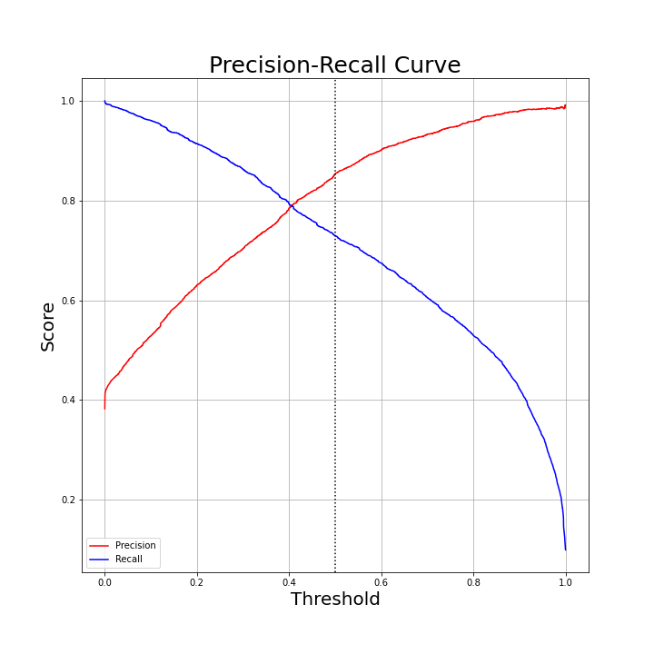

# Tanzanian-Water-Pump-Functionality

**Authors**: Wesley Yu

## Overview

This project will use machine learning techniques to predict functionality of waterpoints in Tanzania.

## Business Problem

The Tanzanian government has set aside a budget to repair non functional water wells. They would like a method to predict the functionality of water wells so that resources can be allocated for repairs. They would also like to know what factors lead to a waterpoint being non functional, so that newly installed waterpoints will have better chances of performing as needed.

## Data

Data set taken from a Driven Data competition containing around 60,000 records of water points  in Tanzania. Each record contains various information of the water points such as, type of pump, location, management, water source, and water quality as well as the functionality of the water point.

Link to competition page: [Pump it Up: Data Mining the Water Table](https://www.drivendata.org/competitions/7/pump-it-up-data-mining-the-water-table/page/25/)

## Methods

Various machine learning algorithms will be tested and hyperparameters tuned to find optimal results based on f1 score.

## Results

Final model was a random forest classifier with tuned hyperparameters. It performed decently in predicting non functional waterpoints, with a precision of 85% and recall of 73%.


Decision threshold can also be adjusted for higher precision at the cost of recall, depending on buisness needs.



Permutation importance shows top 5 features with greatest effect are quantity, waterpoint_type, payment, extraction_type_group, and construction_bins.


Older waterpoints were found to have more non functional than functional.


Dry water quantity has the highest majority of non functional waterpoints.


Waterpoints that do not require payment to use have the majority of non functional. This may be due to less resources avalible to maintain waterpoint.


4 out of the top 6 extraction type were different models of handpumps (nira/tanira, afridev, india mark ii, and swn 80). 


## Conclusions

Based on the features that best effect predictions on the final model we can make the below recommendations.

* Service older waterpoints.
* Find methods to deal with dry waterpoints.
* Allocate resources to help maintain non payment waterpoints.
* improved spring, dam, and cattle trough type waterpoints had less non functional, but there are less of these types probably due to availability of location or cost. We can recommend communal standpipes or hand pumps over communal standpipe multiple and other.
* hand pumps performed the best out of the extraction types. With nira/tanira and afridev having the least non functionals.

 
## Next Steps

* What effects functional waterpoints but needs repairs? Do they eventually lead to non functional if left unrepaired?
* There are many waterpoints with zero population. Were non functional water points abandoned for nearby functional waterpoints?
* Consider other methods of delivering clean water to citizens.


## For More Information

Please review our full analysis in [our Jupyter Notebook Part 1](./Exploratory.ipynb) and [our Jupyter Notebook Part 2](./Modeling.ipynb) or our [presentation]().

For any additional questions, please contact **Wesley Yu at to.wesleyyu@gmail.com**

## Repository Structure

```
├── README.md                           
├── Exploratory.ipynb
├── Modeling.ipynb
├── Presentation.pdf        
├── data                                
└── images                              
```
